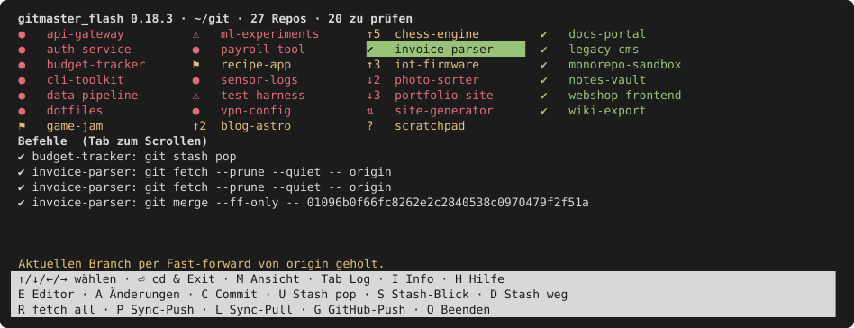
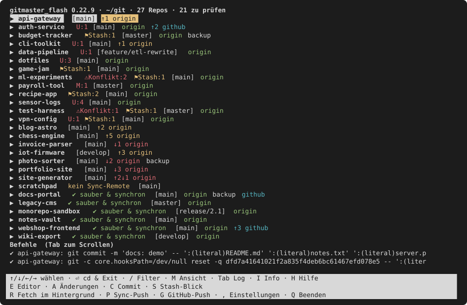
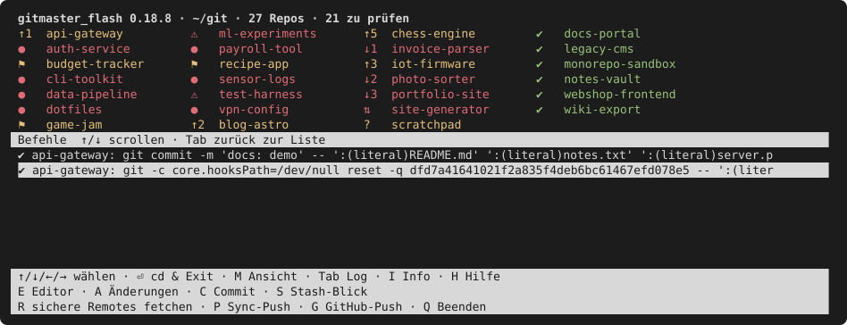

<p align="center">
  
</p>

<h1 align="center">Gitmaster Flash</h1>

**🌐 Sprache / Language:** [English](README.md) · [Deutsch](README.de.md)

<p align="center">
  <em>“It's like a jungle sometimes”</em><br>
  <sub>— Grandmaster Flash and the Furious Five, “The Message”</sub>
</p>

Eine schnelle Terminal-Übersicht (TUI) über alle Git-Repos unterhalb des
aktuellen Ordners: Man sieht auf einen Blick, wo noch etwas liegen geblieben ist,
und räumt es direkt auf.

Grün heißt sauber und mit dem Remote synchron, Rot und Gelb heißen: da ist noch
was. Eine einzige Python-Datei, nur Standardbibliothek — kein `pip install`, kein
Hintergrunddienst, keine Repo-Registrierung. Gescannt wird schlicht alles
unterhalb des Ordners, in dem man es startet.



<sub>Alle Bilder in dieser README werden aus dem echten Programm auf der `--demo`-Sandbox erzeugt — `python3 docs/make-screens.py` (bzw. `--check`). Keine Screenshots, die bei jeder UI-Änderung neu gemacht werden müssen. Der Befehl im Protokoll unter der Liste lief wirklich auf der Sandbox: ein selektiver Commit.</sub>


Zum gefahrlosen Ausprobieren, ohne die eigenen Repos anzufassen:

```sh
python3 gitmaster_flash.py --demo
```

`--demo` baut eine Wegwerf-Sandbox aus Fake-Repos in allen denkbaren Zuständen
und startet die Oberfläche darauf. Sie liegt im Temp-Ordner und kann danach
einfach gelöscht werden.

## Die ersten 60 Sekunden

```sh
git clone https://github.com/DanielMuellerIR/gitmaster_flash.git
cd gitmaster_flash
./install.sh          # Selbsttest, dann `gmf`-Shell-Wrapper registrieren
```

Eine neue Shell oder einen neuen Terminal-Tab öffnen, damit die Wrapper-Zeile
eingelesen wird, danach:

```sh
gmf ~/projekte        # oder einfach `gmf` für den aktuellen Ordner
```

Drei Tasten tragen durch die erste Sitzung:

- `↑`/`↓` wählt ein Repo (`←`/`→` springen in der Kompaktansicht eine ganze
  Spalte weiter); die mit offenen Punkten stehen schon oben.
- `A` zeigt, was sich in einer Datei geändert hat, `C` committet sie geführt.
- `H` listet jeden zustandsändernden Git-Befehl, den gmf für dich ausgeführt hat —
  so lernt man die Syntax nebenbei mit, ohne sie auswendig zu lernen.

Nichts wird gepusht, verworfen oder gelöscht, ohne dass vorher eine Rückfrage den
genauen Befehl nennt. Die Details stehen weiter unten; zum Loslegen braucht man
sie nicht.

## Zwei Ansichten (`M`)

Bis 20 Repos startet gmf in der **Detailansicht**: pro Repo eine volle Zeile mit
Zählern, Branch und Remotes. Darüber wird dieselbe Liste zur langen Scrollstrecke,
deshalb startet dann die **Kompaktansicht** — pro Repo eine Marke und der Name,
spaltenweise gefüllt wie bei `ls`, also über die Breite des Fensters statt über
seine Höhe. Das ist das Bild ganz oben. Die Schwelle steht als `compact_from` in
der `config.json`.

Die Detailansicht bleibt bis einschließlich 20 Repos bewusst Standard: Bei
dieser Größe ist die direkte Anzeige aller Zähler, des Branches und der Remotes
weiterhin die klarste Übersicht. Die Kompaktansicht ersetzt sie nicht, sondern
ist ihre natürliche Weiterentwicklung für eine wachsende Repo-Sammlung. In
wenigen Tastendrücken ist das gesuchte Repo erreicht; `M` zeigt dort anschließend
alle Details.

Die Marke ist der ganze Status, auf ein Feld eingedampft:

| Marke | Bedeutung |
|---|---|
| ✔ | sauber und synchron |
| ● | geänderte, gelöschte oder unversionierte Dateien |
| ⚠ | Merge-Konflikt |
| ⚑ | Stash vorhanden |
| ↑n / ↓n | vor/zurück gegenüber dem Sync-Remote |
| ⇅ | divergiert (gleichzeitig vor und zurück) |
| ✘ | Fehler beim Repo-Scan oder letzter Fetch eines Remotes fehlgeschlagen |
| ? | kein Sync-Remote, kein Remote-Branch oder detached HEAD |

Treffen mehrere Zustände zu, zeigt die Marke den dringendsten: zuerst `✘`, dann
`⚠`, `●`, `⚑`, den Abstand zum Sync-Remote und schließlich `?`. Rot steht für
Fehler, Konflikt, lokale Änderung, fehlende eingehende Commits oder Divergenz;
Gelb für Stash, ausgehende Commits oder eine fehlende Sync-Beziehung; das grüne
`✔` bedeutet sauber und synchron. `M` oder `I` zeigt die Details hinter der
verdichteten Marke.

`M` schaltet zwischen kompakt und Detail um und behält das gewählte Repo — man
sucht es also in der breiten Übersicht und arbeitet dann im Detail daran weiter.
`←`/`→` springen eine Spalte weiter, womit 60 Repos in wenigen Tastendrücken
durchquert sind. Aufklappen von Dateien und Stashes bleibt der Detailansicht
vorbehalten.

## Was eine Detailzeile verrät



- **Remote-Namen sind immer sichtbar** — jede Zeile endet mit allen konfigurierten
  Remotes, auch wenn alles synchron ist. Reihenfolge: privater Sync-Remote zuerst,
  sonstige Remotes danach, GitHub ganz rechts.
- **↑n / ↓n neben einem Remote** — Commits vor/zurück gegenüber genau diesem
  Remote für den aktuellen Branch, auf Basis des letzten Fetch. `R` aktualisiert
  bei allen Remotes aller Repos den aktuellen Branch einzeln, ohne einen Working
  Tree zu ändern. Der Netz-Fetch schreibt keinen lokalen Ziel-Ref; anschließend
  aktualisiert gmf nur den passenden Tracking-Ref, ohne symbolische Refs aufzulösen.
  Scheitern mehrere Remotes aus verschiedenen Gründen, behält jedes seine eigene
  Diagnose samt Git-Fehler.
- **M / D / U** — Anzahl geänderter, gelöschter und unversionierter Dateien.
- **⚑Stash:n** — vorhandene Stashes. Die übersieht man sonst gern.
- **⚠conflict:n** — ungemergte Dateien, etwa nach einem `git stash apply`, der
  nicht sauber aufging. Bewusst getrennt von „modified", weil dahinter andere
  Arbeit steckt.
- Warnungen wie „kein Sync-Remote" oder „Branch nicht auf dem Remote".

Repos mit offenen Punkten stehen oben, saubere unten. Beide Ansichten benutzen
dieselbe Reihenfolge, in der Kompaktansicht ist also die linke Spalte die
interessante.

## Befehlsprotokoll, immer sichtbar

Die letzten Befehle stehen unter der Liste: in der Detailansicht drei Zeilen, in
der Kompaktansicht alles, was die Spalten übrig lassen. `Tab` setzt den Fokus
dorthin — in der Detailansicht wächst der Bereich dafür auf ein Drittel des
Fensters. Der Auswahlbalken wandert mit dem Fokus: Solange man im Protokoll ist,
hat die Repo-Liste keinen — so ist immer klar, wem die Pfeiltasten gerade
gehören. `↑`/`↓` gehen durch die Befehle, `Tab` führt zurück zur Liste; beide
Seiten merken sich, wo man war.



Abgebrochene Dialoge erscheinen als `⊘ … (nicht ausgeführt — abgebrochen)`, damit
das Protokoll nie etwas als gelaufen ausweist, das gar nicht lief. Zwei
`fetch`-Zeilen sind ebenfalls kein Fehler: gmf holt einmal vor der Rückfrage und
einmal nach der Bestätigung und handelt nur, wenn sich dazwischen nichts bewegt;
nur ihre zufälligen Einmal-URL-Aliasse unterscheiden sich (siehe „Sicheres Push").

`H` zeigt dasselbe Protokoll vollständig, über den Sicherheitsregeln. Die reinen
Lesebefehle des Scans stehen bewusst nicht drin — sie würden die interessanten
Zeilen zumüllen. Argumente sind so gequotet, wie eine Shell sie braucht, eine
Zeile lässt sich also direkt übernehmen. Zustandsändernde Aktionen stehen mit
ihren echten, vollständig gebundenen Git-Argumenten im Protokoll; abgebrochene
Bestätigungen bleiben ausdrücklich als nicht ausgeführt markiert.

## Bedienung

Alle Kürzel stehen dauerhaft im Footer — merken muss man sich nichts.
Groß-/Kleinschreibung ist egal, `f` wirkt wie `F`.

| Taste | Aktion |
|---|---|
| ↑ / ↓ | Repo auswählen |
| → / ← | auf-/zuklappen (Dateien mit M/D/U/C, Stashes) |
| / | Repo-Liste nach Namen filtern (siehe unten) |
| , | Einstellungen ansehen und die unkritischen ändern (siehe unten) |
| M | zwischen Kompakt- und Detailansicht umschalten |
| Tab | Fokus ins Befehlsprotokoll und zurück |
| ⏎ | beenden und in den Repo-Ordner wechseln (braucht den `gmf`-Wrapper, siehe unten) |
| E | Repo in einer konfigurierten App öffnen (eigene in `config.json` eintragen) |
| A | Änderungen Datei für Datei in einem rein lesenden Diff-Betrachter prüfen |
| C | Commit-Hilfe mit Auswahl-Vorschlägen (siehe unten) |
| P | aktuellen Branch sicher zum privaten Sync-Remote pushen |
| G | geschützter GitHub-Push: Vorschau der ausgehenden Commits/Dateien, Bestätigung mit J ⏎ |
| H | Befehlsprotokoll dieser Sitzung und Git-Sicherheitsregeln anzeigen |
| I | rein lesende Repo-, Remote- und Branch-Details; dort `T` Remote prüfen |
| S | neuesten Stash als Diff ansehen (read-only, scrollbar) |
| R | jedes sichere Remote im Hintergrund fetchen; die Liste bleibt bedienbar |
| Q | beenden |

Die Stash-Vorschau enthält auch unversionierte und binäre Dateien; ein
fehlgeschlagener oder unerwartet leerer Git-Report wird ausdrücklich
gekennzeichnet. Das Anwenden oder Löschen eines Stashs bleibt danach eine
Terminal-Aufgabe: Git kann Ziel-Branch, Index und Arbeitsbaum nicht atomar gegen
parallele Änderungen binden und das Löschen nicht an einen bestimmten
Reflog-Eintrag koppeln.

## Fetch im Hintergrund (`R`)

`R` fragt jedes sichere Remote nach seinem Stand. Über das Netz und über Dutzende
Repos hinweg dauert das Minuten, deshalb läuft es in einem eigenen Thread: Die
Liste bleibt die ganze Zeit bedienbar, jedes Repo wird eingetragen, sobald sein
eigener Fetch fertig ist, und die Kopfzeile zählt mit — `fetche 12/61`.

Während des Laufs bleibt die Reihenfolge bewusst stehen. Würde bei jedem
eintreffenden Ergebnis neu sortiert, sprängen die Zeilen unter dem Cursor weg und
man handelte an einem anderen Repo als gemeint. Sortiert wird einmal am Ende,
zusammen mit den Repos, die zwischenzeitlich dazugekommen oder verschwunden sind.

Wer während des Laufs committet, pusht oder einen Stash ansieht, behält für
dieses Repo den Stand, den er gerade sieht: Das Ergebnis des Scans dazu ist älter
und wird verworfen. Seine Remote-Zahlen können dann bis zum nächsten `R`
hinterherhinken — der umgekehrte Fehler wäre schlimmer, nämlich einen fertigen
Commit wieder als offene Änderung zu zeigen.

Ein Beenden während des Fetch lässt nichts zurück. gmf beendet die Prozessgruppe
jedes noch laufenden Git-Aufrufs und startet keine neuen mehr; weder Git noch das
von ihm gestartete ssh läuft weiter, wenn die Oberfläche weg ist.

## Repo-Liste filtern (`/`)

Ab einigen hundert Repos ist Tippen schneller als Blättern. `/` öffnet eine
einzeilige Eingabe; die Liste schrumpft auf die Repos, deren **Pfad** den
eingegebenen Text enthält. `Esc` in der Eingabe lässt den bestehenden Filter
stehen, eine leere Eingabe hebt ihn auf, und `Esc` in der Liste hebt einen
aktiven Filter auf, statt das Programm zu beenden.

Mehrere durch Leerzeichen getrennte Begriffe müssen **alle** vorkommen, in
beliebiger Reihenfolge — `arbeit api` findet also auch
`arbeit/kunde/api-server`, ohne dass man den Teil dazwischen kennt.
Groß- und Kleinschreibung spielt keine Rolle.

Der Filter ist reine Anzeige: Er ändert nichts an einem Repo und liest auch
nichts neu ein, das Aufheben geht deshalb ohne Wartezeit. Er trifft
ausschließlich den Pfad, nie Branch, Remote oder Dateiinhalt — der Pfad ist die
einzige Angabe, die in jeder Ansicht sichtbar ist, und ein Filter auf
Unsichtbares ließe einen rätseln, warum ein Repo fehlt.

Weil gmf für die Übersicht da ist, sagt die Kopfzeile durchgehend, was
ausgeblendet ist:

```text
 gitmaster_flash 0.22.5 · ~/git · 3/61 Repos · Filter „api“ · 2 zu prüfen (+7 ausgeblendet)
```

`3/61` ist der sichtbare Anteil, und `+7 ausgeblendet` zählt die vom Filter
entfernten Repos, die Aufmerksamkeit bräuchten. Ohne diese Zahl könnte ein
Filter still genau die Repos verstecken, wegen derer man gmf gestartet hat.

## Änderungen rein lesend prüfen (`A`)

`→` zeigt, *dass* sich eine Datei geändert hat; `A` zeigt, *was* sich darin
geändert hat. Datei mit `↑`/`↓` (oder `Tab`) wählen, `⏎` drücken — der Diff
öffnet sich im scrollbaren Betrachter, auch für neue Dateien, die `git diff`
sonst ignoriert, und für gelöschte.

```text
 Änderungen · api-gateway
 M  README.md
 M  server.py
 U  notizen.txt
 D  alte-config.yml

 ↑/↓ oder Tab Datei wählen · ⏎ Diff ansehen · Q/Esc zurück
```

Diese Ansicht bleibt bewusst rein lesend: Sie ändert keinen Index-Eintrag —
Modus, Objekt-ID, Stufe und Pfad bleiben, wie sie sind — und keine Datei im
Arbeitsbaum. Eine bytegenaue Ausnahme: `git diff` frischt die im Index
gespeicherten Zeitstempel (den Stat-Cache) auch mit `GIT_OPTIONAL_LOCKS=0` auf,
`.git/index` kann dabei also mit unveränderten Einträgen neu geschrieben werden.
Für ein sicheres Verwerfen oder Entfernen aus der Vormerkung müsste
gmf den geprüften Dateistand atomar gegen jeden Editor und jeden parallelen
Git-Prozess binden. Git bietet diese Garantie für einen Arbeitsbaum-Pfad nicht.
Deshalb bleiben solche Aktionen nach ausdrücklicher Prüfung dem Terminal
vorbehalten, statt ungesehene Arbeit zu riskieren.

## Repo-Info und Remotes (`I`)

`I` öffnet für das ausgewählte Repo eine scrollbare Übersicht. Sie
zeigt Pfad, Branch und vollständigen HEAD, letzten Commit, Größe der Historie,
Upstream-Stand, Arbeitsbaum-Zähler, Stashes, Tags an HEAD und alle Remotes.
Fetch- und Push-Adressen stehen getrennt da, weil Git dafür unterschiedliche
Ziele konfigurieren kann. GitHub-Remotes erhalten zusätzlich eine
zugangsdatenfreie Web-URL `https://github.com/…`, die sich in unterstützenden
Terminals direkt öffnen lässt. Eingebettete URL-Zugangsdaten, Query-Parameter
und Fragmente werden nie angezeigt. Das Öffnen der Ansicht verändert nichts.

Die Remotes sind auswählbar: `↑`/`↓` oder `Tab` setzt den Auswahlbalken auf den
nächsten Remote-Block, `Bild↑`/`Bild↓` scrollt den Text.

**`T` prüft das ausgewählte Remote.** Dazu läuft `git ls-remote`, das nur die
Ref-Liste erfragt — es überträgt keine Objekte und ändert lokal nichts. Die
Antwort trennt die Fälle, die sonst gleich aussehen:

| Ergebnis | Bedeutung |
|---|---|
| existiert und antwortet (n Branches) | Adresse stimmt, Zugriff klappt |
| antwortet, hat aber keine Branches | erreichbar, Repo noch leer |
| Adresse erreichbar, aber dort ist kein Repo | gelöscht, umbenannt oder kein Zugriff |
| Server verlangt einen Login | Credential-Helper oder SSH-Key fehlt |
| aus dieser Sitzung nicht messbar | der Credential-Helper braucht den Login-Schlüsselbund, den nur die GUI-Sitzung öffnet |
| SSH-Hostschlüssel unbekannt oder geändert | einmal im Terminal verbinden und prüfen |
| Hostname nicht auflösbar | kein Netz oder DNS-Problem |
| keine Verbindung zum Host | offline, Firewall oder Server aus |
| Server antwortet mit Fehler | Problem dort, nicht am eigenen Repo |
| keine Antwort in n Sekunden | Netz oder Server zu langsam |

Unterhalb dieser Klartext-Einordnung bewahrt die Info-Ansicht zusätzlich Gits
eigene Fehlermeldung als Beleg auf.

Die Info-Ansicht ist bewusst rein lesend. `T` prüft das gewählte Remote und
bewahrt Gits redigierte Antwort als Beleg auf. Lokale Branches erscheinen mit
letztem Commit, Upstream, Vorsprung/Rückstand und Merge-Zustand; gmf entfernt aber
weder Remotes noch Branches. Git würde dabei auch ihre Reflogs löschen. Darin kann
der letzte lokale Verweis auf Commits liegen, und ein ehrlicher
Rückgängig-Befehl kann ihn nicht rekonstruieren. Das Entfernen bleibt deshalb
nach Prüfung dieser Details eine ausdrückliche Terminal-Aufgabe. Stashes werden
rein lesend angezeigt; Anwenden und Löschen bleiben ebenfalls ausdrückliche
Terminal-Aufgaben.

Die Werte stehen linksbündig in einer Spalte, und identische Fetch-/Push-Adressen
teilen sich eine `Fetch+Push`-Zeile — getrennt erscheinen sie nur, wenn sie
wirklich abweichen (`git remote set-url --push` erlaubt das, gmf sperrt dann
Transfers).

```text
 Repo-Info · api-gateway
Pfad:            ~/projekte/api-gateway
Branch:          main
HEAD:            a1b2c3d (a1b2c3d4e5f6789012345678901234567890abcd)
Letzter Commit:  2026-07-25T10:30:00+02:00 · Beispielautor
  feat: add health endpoint
Historie:        42 Commit(s) · vollständiger Clone
Upstream:        origin/main (0 voraus / 0 zurück)
Arbeitsbaum:     sauber
Stashes:         0
Tags an HEAD:    v1.4.0

Remotes:
  origin [Sync]
    Fetch+Push:   git@example.invalid:team/api-gateway.git
    Branch main:  0 voraus / 0 zurück

  github [GitHub, letzter Fetch fehlgeschlagen]
    Fetch+Push:   https://github.com/example/api-gateway.git
    Web:          https://github.com/example/api-gateway
    Branch main:  2 voraus / 0 zurück

Lokale Branches:
  main [aktuell]
    Commit:       a1b2c3d · 2026-07-25 · feat: add health endpoint
    Upstream:     origin/main (0 voraus / 0 zurück)

  spike-caching [gemergt]
    Commit:       9f8e7d6 · 2026-07-11 · einfacheren Cache-Key probiert
    Upstream:     (keine)
```

## Commit-Hilfe (`C`)

```
 Commit-Hilfe · api-gateway — 4/6 gewählt, prüfen, dann ⏎
 M  README.md                                  ✔ committen
 U  notes.txt                                  ✔ committen
 U  server.py                                  ✔ committen
 U  build/out.o                                ✔ committen
 D  old-draft.md                               — gestaget und gelöscht: nichts zu committen
 U  vendor/lib/                                — fremdes Repo: im Terminal erledigen

 ␣ committen an/aus · G Vorschläge · A alle · N keine · ⏎ weiter · Esc abbrechen
```

1. Alle geänderten und neuen Dateien werden gelistet. `␣` wählt sie an oder ab;
   die Hilfe ändert vor dem Commit weder `.gitignore` noch eine andere Datei im
   Arbeitsbaum. `A` wählt alle, `N` keine. Zwei Arten von Einträgen lassen sich
   gar nicht anwählen. Eine Datei, die gestaget und danach gelöscht wurde
   (`git add x && rm x`): Die Hilfe committet die freigegebenen Pfade gegenüber
   `HEAD`, und so ein Pfad steht weder in `HEAD` noch im Arbeitsbaum — es gibt
   nichts zu committen. Und ein Pfad mit `/` am Ende, also ein weiteres
   Git-Repo mitten im Arbeitsbaum: `git add` machte daraus stillschweigend einen
   Submodul-Verweis, und `git commit -- sub/` lehnt es ebenfalls ab. Sichtbar
   bleiben beide, denn beide Unterschiede sind echt; sie sagen es nur, statt den
   ganzen Commit scheitern zu lassen.

   Alles andere bleibt anwählbar, auch Pfade, die gegenüber `HEAD` am Ende
   nichts beitragen — ein per `git rm --cached` entfernter Pfad, ein Submodul
   mit nur schmutzigem Arbeitsbaum. Der Commit lässt sie dann einfach weg, genau
   wie `git commit -- <pfad>`. Erst wenn KEIN gewählter Pfad etwas beiträgt,
   sagt die Hilfe das, statt zu committen.
2. `G` bietet fertige Teilmengen an — denn bei dreißig geänderten Dateien will
   man meist mehrere zusammenhängende Commits statt eines großen. Drei Sichten:
   nach Art der Änderung (geändert / neu / gelöscht), nach oberstem Ordner und
   nach Dateiendung. Ein Vorschlag, der *alle* Dateien enthielte, fällt weg, und
   zwei Sichten auf dieselben Dateien erscheinen nur einmal — so bleibt die Liste
   kurz:

   ```
    Vorschläge — einer davon ersetzt die aktuelle Auswahl

      geänderte Dateien (4)
      Ordner src/ (3)
      Ordner docs/ (2)
   ```

   Ein gewählter Vorschlag *ersetzt* die Auswahl, statt sie zu ergänzen — nach
   zwei Vorschlägen wüsste sonst niemand mehr, was angehakt ist. Eine
   Umbenennung wird nie getrennt: Quelle und Ziel müssen in denselben Commit,
   deshalb zieht ein Vorschlag, der eine Hälfte trifft, die andere mit und sagt
   das mit `+ Rename-Partner`. Vorschläge setzen nur Haken; committet wird erst
   nach der Bestätigung im nächsten Schritt.
3. Vor der Eingabe der Commit-Message zeigt das Tool die letzten Messages des
   Repos als Stil-Vorlage — so viele, wie über der Eingabezeile Platz haben; die
   Eingabezeile bleibt immer sichtbar.
4. Merge-Konflikte sperren die Hilfe vollständig. Der Commit entsteht über einen temporären Index,
   der ausschließlich die freigegebenen Pfade enthält; ein bestehender Benutzer-Index
   samt bewusst gestagter, aber abgewählter Arbeit bleibt erhalten. Für die
   committeten Pfade übernimmt der echte Index den neuen Commit — genau wie bei
   `git commit -- <pfad>`; sonst meldete `git status` sie weiterhin als geändert.
   Push bleibt eine getrennte, bewusste Aktion mit `P`. Nach einem gewöhnlichen
   lokalen Commit nennt die Ergebniszeile
   `git -c core.hooksPath=/dev/null update-ref --no-deref refs/heads/<Branch> <alte-OID> <neue-OID>`
   als Rückgängig-Befehl. Nach dem allerersten Commit verwendet sie
   `git -c core.hooksPath=/dev/null update-ref --no-deref -d refs/heads/<Branch> <neue-OID>`.
   Der `core.hooksPath`-Teil steht dort, weil gmf den Befehl genau so ausführt:
   Ein Rückgängig-Machen darf den `reference-transaction`-Hook des Repos nicht
   starten. Der vollständige Ref bindet
   das Undo auch nach einem Checkout an den freigegebenen Branch; die erwartete
   neue OID verhindert zusätzlich jede Änderung, wenn dieser Branch weitergezogen
   ist. Die committeten Dateien bleiben vorgemerkt und auf der Festplatte. Bei
   detached HEAD ist die Hilfe gesperrt.

## Installation

Vorausgesetzt werden Python 3 und ein Terminal. Sonst nichts.

```sh
git clone https://github.com/DanielMuellerIR/gitmaster_flash.git
python3 gitmaster_flash/gitmaster_flash.py
```

Damit ⏎ tatsächlich in den Repo-Ordner wechselt, den Shell-Wrapper einbinden.
Der Grund: Ein Kindprozess kann das Arbeitsverzeichnis der aufrufenden Shell
nicht ändern — das muss eine kleine Shell-Funktion übernehmen. `install.sh`
erledigt das: Es führt den Selbsttest aus und registriert den sicher gequoteten
absoluten Pfad zu `gmf.zsh` in der `~/.zshrc` (idempotent — ein zweiter Lauf ändert
nichts, auch bei Clone-Pfaden mit Leerzeichen oder Shell-Metazeichen). Beim
Anhängen schließt es außerdem eine vorhandene letzte Zeile ohne Zeilenschaltung
ab, damit der `source`-Befehl nicht mit ihr verschmilzt:

```sh
gitmaster_flash/install.sh
```

Eine bereits vorhandene Zeile auf denselben Wrapper wird in jeder Schreibweise
erkannt (`~/…`, `$HOME/…`, mit oder ohne Quotes); nur ein wirklich anderer Pfad
hält die Installation an und verlangt Handarbeit.

Oder die Zeile von Hand eintragen:

```sh
printf '\n%s\n' 'source /pfad/zu/gitmaster_flash/gmf.zsh' >> ~/.zshrc
```

In einer neuen Shell startet dann `gmf` das Tool (und wechselt am Ende dorthin,
wohin man wollte):

```sh
cd ~/projekte && gmf
```

Ohne Wrapper funktioniert alles genauso, nur gibt ⏎ den Pfad aus, statt
hineinzuwechseln.

## Zwei Rechner vergleichen: `--diff` (nur lesend)

Wer dieselben Repos auf mehreren Rechnern hat (Laptop + Desktop, Mac + Linux), bekommt
Unterschiede, vor denen Git nicht warnt. **Remotes liegen in `.git/config` und werden von
Git nie übertragen** — ein `github`-Remote auf dem einen Rechner fehlt auf dem anderen
schlicht, ein fälliger Push ist dort also unsichtbar. Dasselbe gilt für Branches, die
gerade nicht ausgecheckt sind.

```sh
gmf --diff meinmac            # ~/git hier gegen ~/git auf meinmac
gmf --diff meinmac --json     # maschinenlesbar
gmf --diff meinmac:~/code     # anderes Verzeichnis drüben
gmf --diff meinmac --fetch    # vorher die ↑/↓-Zahlen auffrischen
```

Ausgegeben werden **nur die Unterschiede**, getrennt in Klassen — diese Trennung
ist der Punkt, ein Report der alles meldet wird ignoriert:

```
DRIFT  favenio: Remote 'github' nur hier (Git uebertraegt Remotes nie)
DRIFT  notizen: origin hier 4 voraus/2 zurueck, auf meinmac 0/0
SYNC   musik: origin auf beiden Rechnern 0 voraus/3 zurueck
lokal  webapp: [main] hier, [feature/x] auf meinmac
lokal  blog: 3 geaenderte/neue Datei(en) hier
nur auf meinmac: experiment
```

`DRIFT` umfasst außerdem Fehler, Konflikte, Stashes, Branch-Verfügbarkeit,
Remote-Sicherheitsklassen (einschließlich der Frage, ob Fetch-/Push-URLs ohne
offengelegte Zugangsdaten ausführbar sind) und zugangsdatenfreie Ziel-Fingerprints.
Die eingetragene URL eines Remotes wird nie als solche serialisiert, nur ihr
Fingerprint. Zugangsdaten gelangen überhaupt nicht ins JSON: Eine zitierte
Git-Fehlerzeile behält als Beleg die Zieladresse (Host und Repo-Pfad), ihr
Benutzerteil sowie Query und Fragment werden vorher entfernt.
`DRIFT` = sollte gleich sein, ist es nicht
(Handlungsbedarf). `SYNC` = beide
Rechner sind sich einig, stehen aber gemeinsam vor/hinter dem Sync-Remote — im
reinen Zwei-Rechner-Vergleich unsichtbar, und doch meist die eigentlich
interessante Zahl. `lokal` = erklärbar (anderer Branch ausgecheckt, dirty).
Exit **0** = nichts zu melden, **1** = Befunde (Achtung: bei einer `SYNC`-Zeile
sind sich die Rechner untereinander einig — „beide Rechner identisch" allein
garantiert also keinen Exit 0 mehr), **2** = anderer Rechner nicht erreichbar.

**Voraussetzung:** `ssh HOST` muss funktionieren — mehr nicht. gitmaster_flash muss auf
dem anderen Rechner **nicht** installiert sein: das Skript geht per stdin rüber, drüben
braucht es nur `python3` und `git`. Nebeneffekt: beide Seiten laufen immer in exakt
derselben Fassung, Versionsdrift ist ausgeschlossen. Funktioniert auch gegen Linux.

**Branch, Index und Arbeitsbaum bleiben unangetastet** — keine Remotes angelegt,
nichts committet oder gepusht. Es sagt, was anders ist; das Reparieren bleibt bei
dir. Zweierlei schreibt es trotzdem: `--fetch` führt auf beiden Rechnern einen
echten Fetch aus; Tag-Holen, Tag-Pruning und Submodul-Rekursion sind abgeschaltet.
Je Remote holt gmf nur die angekündigte Objekt-ID des aktuellen Branches ohne
lokalen Ziel-Ref und aktualisiert danach ausschließlich
`refs/remotes/<remote>/<Branch>` mit `--no-deref`. Die geprüfte URL läuft über
einen Einmal-Alias; unsichere Remotes werden gemeldet statt ausgeführt. Der
allererste Lauf legt außerdem `~/.config/gitmaster_flash/config.json` an, auf dem
befragten Rechner ebenso, weil dort dasselbe Skript läuft.

**Tipp:** Rechner in `~/.ssh/config` eintragen und `ControlMaster auto` /
`ControlPath ~/.ssh/cm-%C` / `ControlPersist 60s` setzen. Ein `--fetch`-Scan kann
repoübergreifend bis zu acht ssh-Verbindungen gleichzeitig öffnen (jeder Git-Fetch
selbst nutzt genau einen Job), und der sshd-Default (`MaxStartups 10:30:100`) kann
sonst zufällig welche davon verwerfen — das sieht aus wie ein kaputtes Repo, ist
aber keins.

## Nicht-interaktiv (Skripte, CI, Agenten)

```sh
python3 gitmaster_flash.py --list          # farbige Textliste
python3 gitmaster_flash.py --json          # maschinenlesbar
python3 gitmaster_flash.py --json --fetch  # vorher je Repo fetchen
python3 gitmaster_flash.py --filter api    # nur Repos, deren Pfad passt
python3 gitmaster_flash.py --lang de       # Ausgabesprache festlegen
python3 gitmaster_flash.py --version       # nur die Versionsnummer, sonst nichts

# Jede Ausgabe nennt die Version — so zeigt ein Diff zweier Rechner-Ausgaben,
# ob dieselbe Fassung dahintersteckt:
#   --list-Kopfzeile: gitmaster_flash 0.6.0 · $HOME/git · 61 Repos
#   --json (ab 0.6.0): {"version": "0.6.0", "root": "…", "repos": [ … ]}
#                      (vor 0.6.0 gab --json ein nacktes Array aus)
```

`--filter` nimmt dieselben Begriffe wie `/` in der Oberfläche und wirkt auf
`--list`, `--json` und `--diff`; interaktiv gestartet belegt er den Filter vor,
den `/` dann ändert. Bei `--diff` grenzt er **beide** Rechner mit denselben
Begriffen ein — nur eine Seite zu filtern ergäbe „nur hier"-Unterschiede, die es
gar nicht gibt. Jede Ausgabe nennt den aktiven Filter: die `--list`-Kopfzeile,
ein strukturiertes `filter`-Objekt im JSON (Suchtext, Treffer- und Gesamtzahl)
und beim Textbericht von `--diff` eine erste Zeile mit den Zahlen beider Rechner.
Ein Filter ohne einen einzigen Treffer sagt das auf stderr — auf
stdout sähen leere Liste oder „keine Unterschiede" mit Exit-Code 0 sonst genau
wie „alles in Ordnung" aus.

Exit-Code 0 heißt: alles sauber und synchron. 1 heißt: mindestens ein Repo
braucht Aufmerksamkeit; gezählt wird über die Repos, die den Filter passiert
haben. Ohne TTY gibt das Tool die Liste aus, statt die
Oberfläche zu starten — in einer Pipe passiert also das Erwartbare.

Einen weiteren Schalter gibt es, er ist aber nicht zum Tippen gedacht:
`--cd-file` nennt die Datei, aus der der `gmf`-Shell-Wrapper den ausgewählten
Repo-Pfad liest. Der Wrapper übergibt sie; von Hand aufgerufen bringt sie nichts.

## Einstellungen in der Oberfläche (`,`)

`,` öffnet eine Liste der Einstellungen, `↑`/`↓` wählt eine aus, `⏎` ändert sie.
Die Zeile über dem Footer erklärt jeweils die Zeile, auf der man steht. Ein
geänderter Wert gilt sofort und wird in die `config.json` zurückgeschrieben —
atomar über eine Nachbardatei, damit ein abgebrochener Schreibvorgang nicht eine
halbe Datei und keine einzige eigene Einstellung hinterlässt.

Hier änderbar: Sprache, ab wann die Kompaktansicht startet, die vier Timeouts
und die Ordner, die der Scan auslässt. Jede Eingabe wird vor dem Speichern
geprüft — ein Timeout `abc` erreicht die Datei nie, und ein übersprungener Ordner
muss ein *Name* sein, weil der Scan ihn mit einzelnen Pfadsegmenten vergleicht
und ein Eintrag wie `a/b` deshalb nie zutreffen könnte.

Zwei Gruppen bleiben bewusst der Datei vorbehalten; die Ansicht zeigt sie
schreibgeschützt mit genau diesem Hinweis:

- `sync_remote_names` / `sync_remote_hosts` entscheiden, welches Remote als
  privater Sync-Remote gilt — und damit, wohin `P` pusht. Eine Zieländerung
  gehört nicht hinter einen Tastendruck in einer Liste, durch die man gerade
  scrollt.
- `apps` enthält Programmpfade, die gmf mit `open -a` startet. Ein Pfad, den man
  in eine einzeilige Eingabe tippt, ist kein Pfad, den jemand geprüft hat.

Sie schreibgeschützt zu zeigen ist besser als sie zu verstecken: Eine
Einstellung, die man nicht findet, ist schlimmer als eine, die man in der Datei
ändern muss.

## Konfiguration

`~/.config/gitmaster_flash/config.json`, wird beim ersten Start angelegt:

- `apps` — Taste → App zum Öffnen des Repos (macOS `open -a`). Die Taste taucht
  automatisch im Footer auf: `{"Z": {"name": "Zed", "path":
  "/Applications/Zed.app"}}` ergibt `Z Zed`. Eine Taste wählen, die oben in der
  Tabelle nicht schon belegt ist. Innerhalb einer SSH-Sitzung verweigert gmf die
  Aktion mit einer klaren Erklärung: Eine App lässt sich nur auf dem Mac öffnen,
  an dem man direkt arbeitet.
- `sync_remote_names` / `sync_remote_hosts` — woran der private Sync-Remote
  erkannt wird: am Remote-Namen oder an einem exakt normalisierten Host in der
  Remote-URL (Teiltreffer werden nie akzeptiert). Für eine
  generische Installation ist der Standard `origin`. Alle Remotes werden
  unabhängig davon angezeigt; GitHub wird an seiner URL erkannt und zuletzt
  einsortiert.
- `skip_dirs` — Ordner, die der Scan gar nicht erst betritt.
- `lang` — `"en"`, `"de"` oder `null` für automatisch nach `$LANG`.
- `compact_from` — wird diese Repo-Anzahl überschritten, startet gmf in der
  Kompaktansicht (Standard 20: bis einschließlich 20 bleibt die Detailansicht;
  `M` schaltet jederzeit um).
- `git_timeout` — Sekunden pro lokalem git-Aufruf (Standard 10).
- `fetch_timeout` — Sekunden pro Fetch-Aufruf (Standard 30).
- `diff_timeout` — harte Laufzeitgrenze für den gesamten SSH-Vergleich
  (Standard 3600 Sekunden). Einzelne Git-Aufrufe behalten `git_timeout` oder
  `fetch_timeout`; für den SSH-Verbindungsaufbau gilt zusätzlich eine eigene
  Grenze von zehn Sekunden.
- `commit_timeout` — Sekunden allein für `git commit` (Standard 120). Dabei läuft
  der pre-commit-Hook des Repos, der oft Linter oder Tests startet und deutlich
  länger braucht als `git_timeout`. Wird die Grenze erreicht, werden git *und*
  alles vom Hook Gestartete beendet, und gmf meldet das, statt abzustürzen.

## Sicheres Push

`P` ist absichtlich auf einen nichtöffentlichen Sync-Remote begrenzt. Die Aktion
fetcht zuerst, verlangt einen sauberen Arbeitsbaum und blockiert Rückstand oder
divergente History. Fetch- und Push-URL müssen genau dasselbe zugangsdatenfreie
Host-/Repo-Ziel bezeichnen; mehrere oder abweichende Push-URLs werden gesperrt.
Der bei Hosting-Diensten übliche Mix — Fetch per HTTPS, Push per SSH über den
virtuellen Benutzer `git` — gilt dabei als dasselbe Ziel:
`git@host:org/repo` und `https://host/org/repo` meinen dasselbe Repo.
Unmittelbar vor der bestätigten Mutation werden Branch, HEAD, Index, Arbeitsbaum,
Remote-Identität und Ziel-OID nochmals geprüft. Push überträgt die freigegebene Commit-OID mit
einem expliziten Refspec. Eine exakte Ziel-OID-Lease verhindert, dass eine
Remote-Löschung oder parallele Verschiebung daraus eine ungeprüfte Aktualisierung
macht; Tags und Submodul-Commits werden nie gesendet. Für diesen einen Push sind
außerdem Repo-Hooks abgeschaltet, damit ein pre-push-Hook keine ungeprüften Tags
oder weiteren Refs veröffentlicht. Die Übertragung verwendet die
exakt geprüfte URL statt eines Remote-Namens, den eine parallele Konfigurationsänderung
umleiten könnte. Die Fetch-Refspec muss `refs/heads/<Branch>` auf den passenden
Tracking-Ref dieses Remotes abbilden.

Pull bleibt eine Terminal-Aktion. Branch, Index und Arbeitsbaum lassen sich
gegenüber parallelen Git-Prozessen nicht atomar an den in dieser TUI freigegebenen
Stand binden. gmf riskiert deshalb keinen Fast-forward auf einen Branch, der im
Race-Fenster ausgecheckt wurde.

Für GitHub gibt es den getrennten `G`-Pfad. Er funktioniert nur, wenn derselbe
Branch auf genau einem GitHub-Remote bereits existiert und die Historien verbunden
sind. Vor der Veröffentlichung zeigt er alle ausgehenden Commits und geänderten
Dateinamen. Die Rückfrage steht unter dieser Liste als weißer Balken auf Schwarz
mit rotem `J ⏎ = ja`, einer Leerzeile darüber und sichtbarem Terminal-Cursor
dahinter, damit sie auch nach hundert Dateinamen noch auffällt; beantwortet wird
sie mit `J` + ⏎ (jede andere Eingabe, ein leeres ⏎ oder Esc bricht ab):

```text
 GitHub-Push-Vorschau · app → github/master
 …
 M	components/BEISPIEL_Suche.4dbase/Contents/Info.plist
 A	components/BEISPIEL_Suche.4dbase/Contents/Documentation/Methods/BSP_Version.md

 Diesen Branch zu github veröffentlichen? J ⏎ = ja, sonst Abbruch: ▮      ← Balken
 ↑/↓ scrollen · Esc abbrechen · Zeile 41-72 / 72
```

Die `P`-Rückfrage für das private Sync-Remote nutzt denselben Balken, eine Zeile
über der Fußzeile der Repo-Liste. Auch der letzte
Befehl überträgt nur den aktuellen Branch: freigegebene Quell-OID, exakte
Ziel-Lease, keine Tags, kein neuer Branch. Ein Remote mit mehreren oder
abweichenden Fetch-/Push-Zielen wird vollständig gesperrt, selbst wenn beide
Ziele auf GitHub liegen. Komplexe Fälle bleiben bewusst dem Terminal vorbehalten.

Git fragt hier nie nach Zugangsdaten. Jeder Git-Aufruf läuft ohne Terminal-Prompt,
ohne Askpass und in eigener Session, denn Git schreibt so eine Frage
(`Username for 'https://github.com':`) direkt auf das Terminal statt in die
abgefangene Ausgabe — im curses-Bild zerstört das die Anzeige und Git wartet dann
auf eine Eingabe, die nie kommt. Ein Remote, das einen Login braucht, scheitert
deshalb sofort mit `<Remote> braucht einen Login (kein Credential-Helper/SSH-Key).`
statt zu fragen. HTTPS-Zugangsdaten gehören in einen
Credential-Helper (in einer angemeldeten macOS-GUI-Sitzung:
`git config --global credential.helper osxkeychain`),
oder man nutzt SSH mit einem Key im Agenten; beides läuft ohne Rückfrage.

## Tests

```sh
python3 -m unittest discover -s tests
```

Die Logik (Status-Parsing, Heuristiken, Repo-Scan) ist von der curses-Oberfläche
getrennt und wird headless gegen echte, temporär angelegte Repos getestet.

```sh
python3 docs/make-screens.py --check   # passen die Bilder noch zur Oberfläche?
```

`--check` schlägt fehl, wenn die Bilder in `docs/` anders herauskämen — nach einer
UI-Änderung also `docs/make-screens.py` laufen lassen und das Ergebnis mitcommitten.
Die Aufnahme wartet auf die vollständige Demo-Kopfzeile und nach jeder bestätigten
Git-Aktion auf deren Eintrag im Befehlsprotokoll; bloße Ausgaberuhe gilt nicht als
Abschluss.

## Name

Eine Anspielung auf Grandmaster Flash — es geht ja vor allem ums schnelle
Umschalten zwischen vielen Platten.

## Lizenz

**WTFPL** — siehe [LICENSE](LICENSE).
