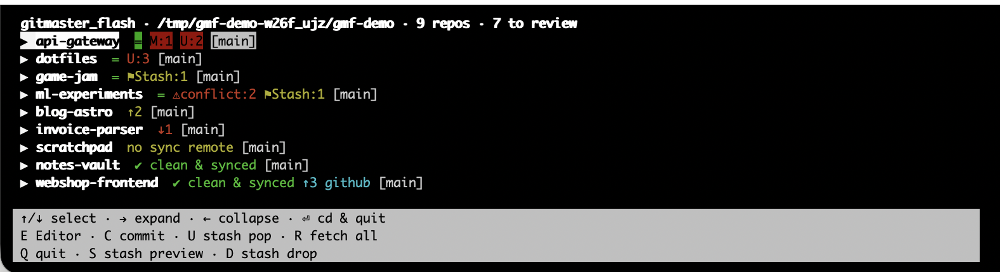
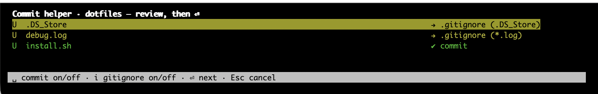

**🌐 Sprache / Language:** [English](README.md) · [Deutsch](README.de.md)

# gitmaster_flash

A fast terminal overview (TUI) of every Git repository below the current
directory, so you can see what still needs attention and tidy it up on the spot.

Green means clean and in sync with your remote; red and yellow mean something is
left over. One Python file, standard library only — no `pip install`, no daemon,
no registration of repositories. It scans whatever is below the directory you
start it in.



Try it without touching your own repositories:

```sh
python3 gitmaster_flash.py --demo
```

`--demo` builds a throwaway sandbox of fake repositories covering every state and
opens the UI on it. The folder lives in your temp directory; delete it when done.

## What a line tells you

- **remote names are always visible** — every line ends with all configured
  remotes, even when everything is synchronized. Their order is the private sync
  remote first, other remotes next, and GitHub at the far right.
- **↑n / ↓n next to a remote** — commits ahead of / behind that exact remote for
  the current branch, based on the last fetch. `R` refreshes every remote in every
  repository with `git fetch --all` without changing a working tree.
- **M / D / U** — number of modified, deleted and untracked files.
- **⚑Stash:n** — stashes that exist in the repo (easy to forget, so it is shown).
- **⚠conflict:n** — unmerged files, e.g. after a `git stash pop` that did not
  apply cleanly. Kept separate from "modified", because it needs different work.
- Warnings such as "no sync remote" or "branch not on remote".

Repositories that need attention sort to the top, clean ones to the bottom.

## Keys

Every shortcut is permanently visible in the footer, so there is nothing to
memorize. Case does not matter — `f` works like `F`.

| Key | Action |
|---|---|
| ↑ / ↓ | select a repository |
| → / ← | expand / collapse (files with M/D/U/C, stashes) |
| ⏎ | quit and `cd` into the repository (needs the `gmf` wrapper, see below) |
| E | open the repository in a configured app (add your own in `config.json`) |
| C | commit helper (see below) |
| P | safely push the current branch to the private sync remote |
| L | safely fast-forward the current branch from the private sync remote |
| G | guarded GitHub push with outgoing-commit/file preview and typed confirmation |
| H | show the Git safety rules inside the TUI |
| U | apply the latest stash (`git stash pop`, with confirmation) |
| S | view the latest stash as a diff (read-only, scrollable) |
| D | drop the latest stash (`git stash drop`, with confirmation) |
| R | reload everything including `git fetch --all` |
| Q | quit |

A stash is never popped onto a tree that already has conflicts — resolve those
first.

## Commit helper (`C`)



1. Every changed and new file is listed with a suggestion: typical junk
   (`node_modules/`, `.DS_Store`, `__pycache__/`, `*.log`, `.env`, …) is proposed
   for **.gitignore**, everything else for **committing**. Both are togglable per
   file (`␣` commit on/off, `i` gitignore on/off).
2. Before you type the commit message, the repository's last five messages are
   shown as a style reference.
3. `.gitignore` is extended without duplicates, the selection is staged and
   committed. Optionally the commit is pushed through the same guarded private
   sync path as `P` afterwards.

## Safe push and pull

`P` and `L` are intentionally limited to a non-public sync remote. Both fetch
first, require a clean working tree and reject divergent history. Pull is an
explicit fast-forward only; it never merges or rebases. Push sends only the
current branch through an explicit refspec, never tags and never force-pushes.

GitHub uses the separate `G` path. It works only when the same branch already
exists on one GitHub remote and the histories are related. Before publishing it
shows every outgoing commit and changed file name. The exact phrase
`PUSH <remote>` must then be typed. The final command still sends only the current
branch: no force, no tags, no new branch. A remote that mixes GitHub and
non-GitHub URLs is blocked entirely. Complex cases stay terminal-only.

## Installation

Requires Python 3 and a terminal. Nothing else.

```sh
git clone https://github.com/DanielMuellerIR/gitmaster_flash.git
python3 gitmaster_flash/gitmaster_flash.py
```

For the `⏎ = cd into the repository` feature, source the shell wrapper — a child
process cannot change the working directory of the shell that started it, so a
small function has to do it. `install.sh` does that for you: it runs the
self-test, then registers `gmf.zsh` in your `~/.zshrc` (idempotent — a second
run changes nothing):

```sh
gitmaster_flash/install.sh
```

Or add the line manually:

```sh
echo 'source /path/to/gitmaster_flash/gmf.zsh' >> ~/.zshrc
```

In a new shell, `gmf` then starts the tool (and `cd`s where you asked it to):

```sh
cd ~/projects && gmf
```

Without the wrapper everything works the same, except that ⏎ prints the path
instead of changing into it.

## Non-interactive use (scripts, CI, agents)

```sh
gitmaster_flash.py --list          # colored text list
gitmaster_flash.py --json          # machine-readable
gitmaster_flash.py --json --fetch  # fetch each repo first

# Every output carries the version — so a diff of two machines' output shows
# whether the same build produced them:
#   --list header:  gitmaster_flash 0.6.0 · /Users/you/git · 61 repos
#   --json (0.6.0+): {"version": "0.6.0", "root": "…", "repos": [ … ]}
#                    (before 0.6.0 --json printed a bare array)
```

Exit code 0 means everything is clean and in sync, 1 means at least one
repository needs attention. Without a TTY the tool prints the list instead of
starting the UI, so a pipe does the sensible thing.

## Configuration

`~/.config/gitmaster_flash/config.json`, created on first run:

- `apps` — key → application used to open a repository (macOS `open -a`). The key
  shows up in the footer automatically, so `{"Z": {"name": "Zed", "path":
  "/Applications/Zed.app"}}` gives you `Z Zed`. Pick a key that is not already
  taken by the table above.
- `sync_remote_names` / `sync_remote_hosts` — how the private sync remote is
  recognized: by remote name, or by host in the remote URL. Defaults to `origin`
  for a generic installation. All remotes are displayed regardless; GitHub is
  recognized from its URL and sorted last.
- `skip_dirs` — directories the scan does not descend into.
- `lang` — `"en"`, `"de"`, or `null` to follow `$LANG`.
- `git_timeout` / `fetch_timeout` — seconds per git call.

## Tests

```sh
python3 -m unittest discover -s tests
```

The logic (status parsing, heuristics, repo scan) is separated from the curses UI
and tested headlessly against real temporary repositories.

## Name

A nod to Grandmaster Flash — the tool is mostly about quick cuts between many
records.

## License

**WTFPL** — see [LICENSE](LICENSE).
