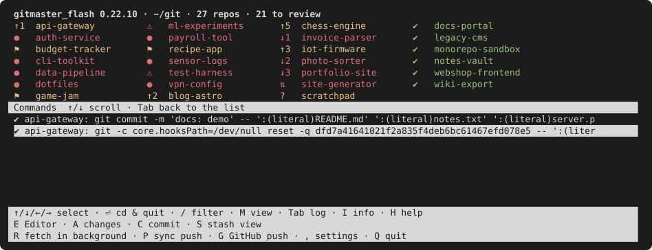

<p align="center">
  
</p>

<h1 align="center">Gitmaster Flash</h1>

**🌐 Sprache / Language:** [English](README.md) · [Deutsch](README.de.md)

<p align="center">
  <em>“It's like a jungle sometimes”</em><br>
  <sub>— Grandmaster Flash and the Furious Five, “The Message”</sub>
</p>

A fast terminal overview (TUI) of every Git repository below the current
directory, so you can see what still needs attention and tidy it up on the spot.

Green means clean and in sync with your remote; red and yellow mean something is
left over. One Python file, standard library only — no `pip install`, no daemon,
no registration of repositories. It scans whatever is below the directory you
start it in.


<sub>Every screen in this README is generated from the real program on the `--demo` sandbox — `python3 docs/make-screens.py` (and `--check` in CI). No screenshots to retake when the UI changes. The command in the log below the list was really run on the sandbox: a selective commit.</sub>


Try it without touching your own repositories:

```sh
python3 gitmaster_flash.py --demo
```

`--demo` builds a throwaway sandbox of fake repositories covering every state and
opens the UI on it. The folder lives in your temp directory; delete it when done.

## First 60 seconds

```sh
git clone https://github.com/DanielMuellerIR/gitmaster_flash.git
cd gitmaster_flash
./install.sh          # self-test, then registers the `gmf` shell wrapper
```

Open a new shell or terminal tab so it reads the new wrapper line, then:

```sh
gmf ~/projects        # or just `gmf` for the current directory
```

Three keys carry you through the first session:

- `↑`/`↓` picks a repository (`←`/`→` jump a whole column in the compact view);
  the ones needing attention are already at the top.
- `A` shows what changed in a file, `C` commits it with a guided helper.
- `H` lists every state-changing Git command gmf ran for you — that is how you
  pick up the syntax without memorizing it.

Nothing is ever pushed, dropped or deleted without a confirmation that names the
exact command first. Details are further down; you do not need them to start.

## Two views (`M`)

With up to 20 repositories gmf opens in the **detail view**: one full line each,
with counts, branch and remotes. Above that the same list turns into a long
scroll, so it starts in the **compact view** instead — one mark plus the name per
repository, filled column by column like `ls`, using the width of the window
rather than its height. That is the screen at the top of this page; the threshold
is `compact_from` in `config.json`.

The detail view deliberately remains the default for 20 repositories or fewer:
at that size, having every count, branch and remote directly on screen is still
the clearest overview. The compact view is its natural evolution as the
collection grows, not a replacement. It gets you to a repository in a few
keystrokes; press `M` there to see all of that repository's details.

The mark is the whole status, condensed into one field:

| Mark | Meaning |
|---|---|
| ✔ | clean and in sync |
| ● | modified, deleted or untracked files |
| ⚠ | merge conflict |
| ⚑ | stash present |
| ↑n / ↓n | ahead of / behind the sync remote |
| ⇅ | diverged (both ahead and behind) |
| ✘ | repository scan error or last fetch failed for a remote |
| ? | no sync remote, no remote branch, or detached HEAD |

When several states apply, the mark shows the most urgent one: `✘`, then `⚠`,
`●`, `⚑`, the sync distance, and finally `?`. Red means an error, conflict,
local change, missing incoming commits or divergence; yellow marks a stash,
outgoing commits or missing sync relationship; green `✔` means clean and
synchronized. `M` or `I` reveals the details behind the condensed mark.

`M` switches between compact and detail view and keeps the selected repository,
so you can find a repository in the wide overview and then work on it in detail.
`←`/`→` move one column at a time, which crosses 60 repositories in a few
keystrokes. Expanding files and stashes stays in the detail view.

## What a detail line tells you


- **remote names are always visible** — every line ends with all configured
  remotes, even when everything is synchronized. Their order is the private sync
  remote first, other remotes next, and GitHub at the far right.
- **↑n / ↓n next to a remote** — commits ahead of / behind that exact remote for
  the current branch, based on the last fetch. `R` refreshes every remote in every
  repository by fetching the current branch from each remote separately, without
  changing a working tree. The network fetch writes no local target ref; gmf then
  updates only the matching tracking ref without dereferencing symbolic refs. If several
  remotes fail for different reasons, each keeps its own diagnosis and Git error.
- **M / D / U** — number of modified, deleted and untracked files.
- **⚑Stash:n** — stashes that exist in the repo (easy to forget, so it is shown).
- **⚠conflict:n** — unmerged files, e.g. after a `git stash apply` that did not
  apply cleanly. Kept separate from "modified", because it needs different work.
- Warnings such as "no sync remote" or "branch not on remote".

Repositories that need attention sort to the top, clean ones to the bottom. Both
views use that same order, so in the compact view the leftmost column is the one
worth reading.

## Command log, always visible

The last commands stay below the list: three lines in the detail view, and in the
compact view everything the columns leave over. `Tab` moves the focus there — in
the detail view the pane grows to a third of the window for it. The selection bar
moves with the focus: while you are in the log, the repository list has none, so
it is always obvious which pane the arrow keys belong to. `↑`/`↓` walk through the
commands, `Tab` returns to the list — both sides remember where you were.



Cancelled dialogs appear as `⊘ … (not run — cancelled)`, so the log never
suggests something ran that did not. Two `fetch` lines are no glitch either:
gmf fetches once before it asks and once after you confirm, and only acts if
nothing moved in between (their random one-time URL aliases differ; see "Safe push").

`H` shows the same log in full, above the safety rules. Read-only scan commands
are deliberately left out — they would bury the interesting lines. Arguments are
quoted the way a shell needs them, so every recorded line can be typed or pasted
as-is. State-changing actions are recorded with their real, fully pinned Git
arguments; cancelled confirmations remain explicitly marked as not run.

## Keys

Every shortcut is permanently visible in the footer, so there is nothing to
memorize. Case does not matter — `f` works like `F`.

| Key | Action |
|---|---|
| ↑ / ↓ | select a repository |
| → / ← | expand / collapse (files with M/D/U/C, stashes) |
| M | switch between compact and detail view |
| Tab | move the focus to the command log and back |
| ⏎ | quit and `cd` into the repository (needs the `gmf` wrapper, see below) |
| E | open the repository in a configured app (add your own in `config.json`) |
| A | inspect changes file by file in a read-only diff viewer |
| C | commit helper (see below) |
| P | safely push the current branch to the private sync remote |
| G | guarded GitHub push with outgoing-commit/file preview and typed confirmation |
| H | show the command log of this session plus the Git safety rules |
| I | read-only repository, remote and branch details; there: `T` tests a remote |
| S | view the latest stash as a diff (read-only, scrollable) |
| R | reload everything and fetch each safe remote separately |
| Q | quit |

The stash preview includes untracked and binary files; a failed or unexpectedly
empty Git preview is labelled explicitly. Applying or deleting a stash remains a
terminal task after that review: Git cannot atomically bind the target branch,
index and working tree against concurrent changes, nor bind deletion to one
specific reflog entry.

## Changes: read-only inspection (`A`)

`→` shows *that* a file changed; `A` shows *what* changed in it. Pick a file with
`↑`/`↓` (or `Tab`), press `⏎`, and its diff opens in the scrollable viewer —
including new files, which `git diff` normally ignores, and deleted ones.

```text
 Changes · api-gateway
 M  README.md
 M  server.py
 U  notes.txt
 D  old-config.yml

 ↑/↓ or Tab select file · ⏎ show diff · Q/Esc back
```

This view is deliberately read-only: it changes no index entry — mode, object ID,
stage and path all stay as they are — and no working-tree file. One byte-level
exception: `git diff` refreshes the index stat cache (the recorded timestamps)
even with `GIT_OPTIONAL_LOCKS=0`, so `.git/index` may be rewritten with unchanged
entries. Discarding or unstaging a file would require an atomic comparison with
every editor and Git process that may change it between preview and mutation.
Git does not provide that guarantee for a working-tree path, so gmf leaves these
actions to an explicitly reviewed terminal command instead of risking unseen data
loss.

## Repository info and remotes (`I`)

`I` opens a scrollable overview for the selected repository. It shows the path,
branch and full HEAD, latest commit, history size, upstream ahead/behind state,
working-tree counts, stashes, tags at HEAD, and every remote.
Fetch and push addresses are listed separately because Git can configure them to
different targets. GitHub remotes additionally get a credential-free
`https://github.com/…` web URL that can be opened directly from supporting
terminals. Embedded URL credentials, query parameters, and fragments are never
displayed. Opening the view changes nothing.

The remotes are selectable: `↑`/`↓` or `Tab` moves the highlight from one remote
block to the next, `PgUp`/`PgDn` scrolls the text.

**`T` tests the selected remote.** It runs `git ls-remote`, which only asks for
the remote's ref list — no objects are transferred and nothing changes locally.
The answer distinguishes the cases that otherwise look identical:

| Result | Meaning |
|---|---|
| exists and answers (n branches) | address correct, access works |
| answers but has no branches | reachable, repository still empty |
| address reachable, but no repository there | deleted, renamed, or no access |
| server wants a login | credential helper or SSH key missing |
| not measurable from this session | the credential helper needs the login keychain, which only the GUI session opens |
| SSH host key unknown or changed | connect once in a terminal and verify it |
| host name does not resolve | no network or DNS problem |
| no connection to the host | offline, firewall, or the server is down |
| server replied with an error | problem on their side, not your repository |
| no answer within n seconds | network or server too slow |

The info view also keeps Git's own error message as evidence, underneath the
plain-language classification.

The info view is deliberately read-only. `T` tests the selected remote and keeps
Git's redacted response as evidence. Local branches are listed with their last
commit, upstream, ahead/behind and merge state, but gmf does not remove remotes or
branches: Git would also delete their reflogs, which can contain the last local
reference to commits and cannot be reconstructed by an honest undo command.
Removal remains an explicit terminal task after reviewing those details. Stashes
are previewed read-only; applying or deleting them remains an explicit terminal
task as well.

Values line up in one column, and identical fetch/push addresses share a single
`fetch+push` line — they are only listed separately when they really differ
(`git remote set-url --push` allows that, and gmf then blocks transfers).

```text
 Repository info · api-gateway
Path:            ~/projects/api-gateway
Branch:          main
HEAD:            a1b2c3d (a1b2c3d4e5f6789012345678901234567890abcd)
Last commit:     2026-07-25T10:30:00+02:00 · Example Author
  feat: add health endpoint
History:         42 commit(s) · full clone
Upstream:        origin/main (0 ahead / 0 behind)
Working tree:    clean
Stashes:         0
Tags at HEAD:    v1.4.0

Remotes:
  origin [sync]
    fetch+push:   git@example.invalid:team/api-gateway.git
    branch main:  0 ahead / 0 behind

  github [GitHub, last fetch failed]
    fetch+push:   https://github.com/example/api-gateway.git
    web:          https://github.com/example/api-gateway
    branch main:  2 ahead / 0 behind

Local branches:
  main [current]
    commit:       a1b2c3d · 2026-07-25 · feat: add health endpoint
    upstream:     origin/main (0 ahead / 0 behind)

  spike-caching [merged]
    commit:       9f8e7d6 · 2026-07-11 · try a simpler cache key
    upstream:     (none)
```

## Commit helper (`C`)

```
 Commit helper · api-gateway — review, then ⏎
 M  README.md                                                    ✔ commit
 U  notes.txt                                                    ✔ commit
 U  server.py                                                    ✔ commit
 U  build/out.o                                                  ✔ commit

 ␣ commit on/off · ⏎ next · Esc cancel
```

1. Every changed and new file is listed. `␣` selects or excludes it; the helper
   never edits `.gitignore` or any other working-tree file before the commit.
2. Before you type the commit message, the repository's recent messages are shown
   as a style reference — as many as fit above the input line, which always stays
   visible.
3. Merge conflicts block the helper completely. The commit is built in a temporary index containing
   only the approved paths; an existing user index, including deliberately staged
   but excluded work, stays intact. For the committed paths the real index adopts
   the new commit, exactly as `git commit -- <path>` does — otherwise `git status`
   would keep reporting them as modified. Push remains a separate, deliberate `P`
   action. After an ordinary local commit, the result line includes
   `git -c core.hooksPath=/dev/null update-ref --no-deref refs/heads/<branch> <old-oid> <new-oid>`
   as the undo command. After the very first commit it uses
   `git -c core.hooksPath=/dev/null update-ref --no-deref -d refs/heads/<branch> <new-oid>`.
   The `core.hooksPath` part is shown because gmf runs it that way: undoing a
   commit must not start the repository's own `reference-transaction` hook. The
   full ref keeps the undo
   bound to the approved branch even after a checkout; the expected new OID also
   prevents changing that branch after it has moved. The committed files stay
   staged and on disk. The helper is blocked on a detached HEAD.

## Installation

Requires Python 3 and a terminal. Nothing else.

```sh
git clone https://github.com/DanielMuellerIR/gitmaster_flash.git
python3 gitmaster_flash/gitmaster_flash.py
```

For the `⏎ = cd into the repository` feature, source the shell wrapper — a child
process cannot change the working directory of the shell that started it, so a
small function has to do it. `install.sh` does that for you: it runs the
self-test, then registers the safely quoted absolute path to `gmf.zsh` in your
`~/.zshrc` (idempotent — a second run changes nothing, including from clone paths
with spaces or shell metacharacters). When appending, it also terminates an
existing final line that has no newline, so the `source` command cannot merge
with it:

```sh
gitmaster_flash/install.sh
```

A line that already sources the same wrapper is accepted in any spelling
(`~/…`, `$HOME/…`, quoted or not); only a genuinely different path stops the
installer and asks you to sort it out by hand.

Or add the line manually:

```sh
printf '\n%s\n' 'source /path/to/gitmaster_flash/gmf.zsh' >> ~/.zshrc
```

In a new shell, `gmf` then starts the tool (and `cd`s where you asked it to):

```sh
cd ~/projects && gmf
```

Without the wrapper everything works the same, except that ⏎ prints the path
instead of changing into it.

## Two machines: `--diff` (read-only)

If you keep the same repos on more than one machine (laptop + desktop, Mac + Linux),
they drift apart in ways git never warns you about. **Remotes live in `.git/config`
and git never transfers them** — add a `github` remote on one machine and the other
simply doesn't have it, so a pending push is invisible there. Same for branches you
don't currently have checked out.

```sh
gmf --diff mymac            # compare ~/git here with ~/git on mymac
gmf --diff mymac --json     # machine-readable
gmf --diff mymac:~/code     # different directory on the other side
gmf --diff mymac --fetch    # refresh ahead/behind counts first
```

It prints **only the differences**, split into classes — that split is the point,
a report that lists everything gets ignored:

```
DRIFT  favenio: remote 'github' only here (git never transfers remotes)
DRIFT  notes: origin is 4 ahead/2 behind here, 0/0 on mymac
SYNC   music: origin 0 ahead/3 behind on both machines
local  webapp: [main] here, [feature/x] on mymac
local  blog: 3 changed/new file(s) here
only on mymac: experiment
```

`DRIFT` also covers errors, conflicts, stashes, branch availability, remote safety
classification (including whether fetch/push URLs are executable without exposing
credentials) and credential-free endpoint fingerprints. A remote's configured URL
is never serialized as such — only its fingerprint. Credentials never enter JSON
at all: a quoted Git error line keeps the target address (host and repository
path) as evidence, but its user info, query and fragment are removed before it
gets there. `DRIFT` = should be identical but isn't (worth
acting on). `SYNC` = both machines agree, but together they sit ahead/behind the
sync remote — invisible in a pure two-machine comparison, yet usually the number
you actually care about. `local` = explainable (different branch checked out,
dirty working tree). Exit code **0** =
nothing to report, **1** = findings (note: a `SYNC` line means the machines agree
with each other, so "identical machines" alone no longer guarantees exit 0),
**2** = the other machine could not be reached.

**Requirements:** `ssh HOST` has to work — that's it. gitmaster_flash does **not** need
to be installed on the other machine: the script is piped over stdin, so the remote
only needs `python3` and `git`, and both sides always run the exact same version (no
version drift to reason about). Works against Linux too.

**Branch, index, and working tree stay untouched** — no remotes are added and
nothing is committed or pushed. It tells you what differs; fixing is yours.
Two things it does write: `--fetch` runs a real fetch on both machines — that is
what the flag is for — with tag fetching, tag pruning, and submodule recursion
disabled. For each remote it fetches only the advertised object ID of the current
branch, without a local target ref, then updates only the matching
`refs/remotes/<remote>/<branch>` ref with `--no-deref`. The checked URL is passed
through a one-time alias; unsafe remotes are reported instead of run. The
very first run also creates
`~/.config/gitmaster_flash/config.json`, on the queried machine as well, because the
same script runs there.

**Tip:** put your machines in `~/.ssh/config` and add
`ControlMaster auto` / `ControlPath ~/.ssh/cm-%C` / `ControlPersist 60s`. A `--fetch`
scan may open up to eight ssh connections across repositories at once (each Git fetch
itself uses one job), and the sshd default (`MaxStartups 10:30:100`) can otherwise drop
some of them at random — which looks like a broken repo but isn't.

## Non-interactive use (scripts, CI, agents)

```sh
python3 gitmaster_flash.py --list          # colored text list
python3 gitmaster_flash.py --json          # machine-readable
python3 gitmaster_flash.py --json --fetch  # fetch each repo first
python3 gitmaster_flash.py --lang de       # force the output language
python3 gitmaster_flash.py --version       # bare version number, nothing else

# Every output carries the version — so a diff of two machines' output shows
# whether the same build produced them:
#   --list header:  gitmaster_flash 0.6.0 · $HOME/git · 61 repos
#   --json (0.6.0+): {"version": "0.6.0", "root": "…", "repos": [ … ]}
#                    (before 0.6.0 --json printed a bare array)
```

Exit code 0 means everything is clean and in sync, 1 means at least one
repository needs attention. Without a TTY the tool prints the list instead of
starting the UI, so a pipe does the sensible thing.

One further flag exists but is not meant to be typed: `--cd-file` names the file
the `gmf` shell wrapper reads the selected repository path from. The wrapper
passes it; calling it by hand has no use.

## Configuration

`~/.config/gitmaster_flash/config.json`, created on first run:

- `apps` — key → application used to open a repository (macOS `open -a`). The key
  shows up in the footer automatically, so `{"Z": {"name": "Zed", "path":
  "/Applications/Zed.app"}}` gives you `Z Zed`. Pick a key that is not already
  taken by the table above. Inside an SSH session gmf refuses this action with a
  clear explanation: an app can only open on the Mac where you are working
  directly.
- `sync_remote_names` / `sync_remote_hosts` — how the private sync remote is
  recognized: by remote name, or by an exact normalized host in the remote URL
  (substring matches are never accepted). Defaults to `origin`
  for a generic installation. All remotes are displayed regardless; GitHub is
  recognized from its URL and sorted last.
- `skip_dirs` — directories the scan does not descend into.
- `lang` — `"en"`, `"de"`, or `null` to follow `$LANG`.
- `compact_from` — when the repository count exceeds this number, gmf starts in
  the compact view (default 20: up to 20 use the detail view; `M` switches at any
  time).
- `git_timeout` / `fetch_timeout` — seconds per git call.
- `diff_timeout` — hard wall-clock limit for the complete SSH comparison
  (default 3600 seconds). Individual Git calls still use `git_timeout` or
  `fetch_timeout`; SSH connection setup has a separate ten-second limit.
- `commit_timeout` — seconds for `git commit` alone (default 120). It runs the
  repository's pre-commit hook, which often starts linters or tests and needs far
  longer than `git_timeout`. When the limit is hit, git *and* everything the hook
  started are terminated, and gmf reports it instead of aborting.

## Safe push

`P` is intentionally limited to a non-public sync remote. It fetches first,
requires a clean working tree and rejects behind or divergent history. Fetch and push
URLs must identify one identical credential-free host/repository target; multiple
or differing push URLs are blocked. The mix that is common at hosting services —
fetch over HTTPS, push over SSH through the virtual `git` user — counts as the
same target: `git@host:org/repo` and `https://host/org/repo` mean the same
repository. Immediately before a confirmed mutation the
branch, HEAD, index, worktree, remote identity and target OID are checked again.
Push sends the approved commit OID through an explicit refspec. An exact target-OID lease prevents a
remote deletion or concurrent move from turning it into an unreviewed update;
tags and submodule commits are never sent. The one push also disables repository
hooks, so a pre-push hook cannot publish unreviewed tags or additional refs. The transfer uses the exact URL that was
checked, not a remote name that concurrent configuration could redirect. Its fetch
refspec must map `refs/heads/<branch>` to that remote's matching tracking ref.

Pull remains a terminal operation. Moving a branch, index and working tree cannot
be atomically tied to the state approved by this TUI across concurrent Git
processes; gmf therefore does not risk fast-forwarding a branch checked out in
the race window.

GitHub uses the separate `G` path. It works only when the same branch already
exists on exactly one GitHub remote and the histories are related. Before
publishing it shows every outgoing commit and changed file name. The exact phrase
`PUSH <remote>` must then be typed. The final command still sends only the current
branch: approved source OID, exact target lease, no tags, no new branch. A remote
with multiple or differing fetch/push targets is blocked entirely, even if both
targets are on GitHub. Complex cases stay terminal-only.

Git never asks for credentials here. Every Git call runs with terminal prompts and
askpass disabled and in its own session, because Git writes such a question
(`Username for 'https://github.com':`) straight to the terminal rather than to the
captured output — inside the curses screen that destroys the display and then waits
for input that never arrives. A remote that needs a login therefore fails right away
with `<remote> needs a login (no credential helper or SSH key).` instead of asking.
Store HTTPS credentials in a credential helper (in a logged-in macOS GUI session:
`git config --global credential.helper osxkeychain`) or use SSH with a key in the
agent; both work without any prompt.

## Tests

```sh
python3 -m unittest discover -s tests
```

The logic (status parsing, heuristics, repo scan) is separated from the curses UI
and tested headlessly against real temporary repositories.

```sh
python3 docs/make-screens.py --check   # do the pictures still match the UI?
```

`--check` fails when the screens in `docs/` would come out different — after a UI
change, run `docs/make-screens.py` and commit the result. The capture waits for the
complete demo header and for the command-log entry of each confirmed Git action;
output silence alone is not treated as completion.

## Name

A nod to Grandmaster Flash — the tool is mostly about quick cuts between many
records.

## License

**WTFPL** — see [LICENSE](LICENSE).
