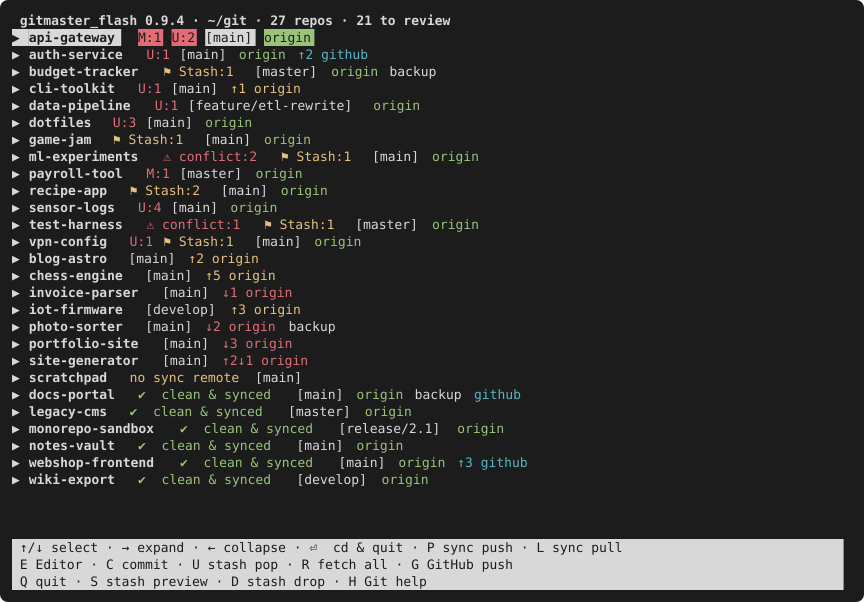
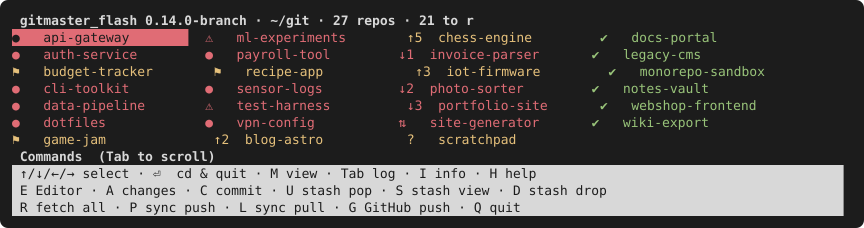

<p align="center">
  
</p>

<h1 align="center">Gitmaster Flash</h1>

**🌐 Sprache / Language:** [English](README.md) · [Deutsch](README.de.md)

<p align="center">
  <em>“It's like a jungle sometimes”</em><br>
  <sub>— Grandmaster Flash and the Furious Five, “The Message”</sub>
</p>

A fast terminal overview (TUI) of every Git repository below the current
directory, so you can see what still needs attention and tidy it up on the spot.

Green means clean and in sync with your remote; red and yellow mean something is
left over. One Python file, standard library only — no `pip install`, no daemon,
no registration of repositories. It scans whatever is below the directory you
start it in.



<sub>The screen above is generated from the real program on the `--demo` sandbox — `python3 docs/make-screens.py` (and `--check` in CI). No screenshots to retake when the UI changes.</sub>


Try it without touching your own repositories:

```sh
python3 gitmaster_flash.py --demo
```

`--demo` builds a throwaway sandbox of fake repositories covering every state and
opens the UI on it. The folder lives in your temp directory; delete it when done.

## First 60 seconds

```sh
git clone https://github.com/DanielMuellerIR/gitmaster_flash.git
cd gitmaster_flash
./install.sh          # self-test, then registers the `gmf` shell wrapper
gmf ~/projects        # or just `gmf` for the current directory
```

Three keys carry you through the first session:

- `↑`/`↓` picks a repository; the ones needing attention are already at the top.
- `A` shows what changed in a file, `C` commits it with a guided helper.
- `H` lists every Git command gmf ran for you — that is how you pick up the
  syntax without memorizing it.

Nothing is ever pushed, dropped or deleted without a confirmation that names the
exact command first. Details are further down; you do not need them to start.

## Two views (`M`)

With more than 20 repositories the detail view becomes a long scroll, so gmf
starts in the **compact view**: one mark plus the name per repository, filled
column by column like `ls`, using the width of the window instead of its height.



| Mark | Meaning |
|---|---|
| ✔ | clean and in sync |
| ● | modified, deleted or untracked files |
| ⚠ | merge conflict |
| ⚑ | stash present |
| ↑n / ↓n | ahead of / behind the sync remote |
| ⇅ | diverged (both ahead and behind) |
| ✘ | last fetch failed for a remote |
| ? | no sync remote, no remote branch, or detached HEAD |

`M` switches between compact and detail view and keeps the selected repository,
so you can find a repository in the wide overview and then work on it in detail.
`←`/`→` move one column at a time, which crosses 60 repositories in a few
keystrokes. Expanding files and stashes stays in the detail view.

## Command log, always visible

The last commands stay below the list — three lines by default. `Tab` moves the
focus there, the pane grows to a third of the window, and `↑`/`↓` scroll through
the session. `Tab` again returns to the list. Cancelled dialogs appear as
`⊘ … (not run — cancelled)`, so the log never suggests something ran that did not.

`H` shows the same log in full, above the safety rules. Read-only scan commands
are deliberately left out — they would bury the interesting lines. Arguments are
quoted the way a shell needs them, so a line can be typed or pasted as-is, and
destructive dialogs show the command before you confirm it: you see
`git remote remove github` while deciding, not afterwards.


## What a line tells you

- **remote names are always visible** — every line ends with all configured
  remotes, even when everything is synchronized. Their order is the private sync
  remote first, other remotes next, and GitHub at the far right.
- **↑n / ↓n next to a remote** — commits ahead of / behind that exact remote for
  the current branch, based on the last fetch. `R` refreshes every remote in every
  repository with `git fetch --all` without changing a working tree.
- **M / D / U** — number of modified, deleted and untracked files.
- **⚑Stash:n** — stashes that exist in the repo (easy to forget, so it is shown).
- **⚠conflict:n** — unmerged files, e.g. after a `git stash pop` that did not
  apply cleanly. Kept separate from "modified", because it needs different work.
- Warnings such as "no sync remote" or "branch not on remote".

Repositories that need attention sort to the top, clean ones to the bottom.

## Keys

Every shortcut is permanently visible in the footer, so there is nothing to
memorize. Case does not matter — `f` works like `F`.

| Key | Action |
|---|---|
| ↑ / ↓ | select a repository |
| → / ← | expand / collapse (files with M/D/U/C, stashes) |
| M | switch between compact and detail view |
| Tab | move the focus to the command log and back |
| ⏎ | quit and `cd` into the repository (needs the `gmf` wrapper, see below) |
| E | open the repository in a configured app (add your own in `config.json`) |
| A | look at the changes: pick a file, see its diff |
| C | commit helper (see below) |
| P | safely push the current branch to the private sync remote |
| L | safely fast-forward the current branch from the private sync remote |
| G | guarded GitHub push with outgoing-commit/file preview and typed confirmation |
| H | show the command log of this session plus the Git safety rules |
| I | repository details and remotes; there: `T` test a remote, `X` remove one |
| U | apply the latest stash (`git stash pop`, with confirmation) |
| S | view the latest stash as a diff (read-only, scrollable) |
| D | drop the latest stash (`git stash drop`, with confirmation) |
| R | reload everything including `git fetch --all` |
| Q | quit |

A stash is never popped onto a tree that already has conflicts — resolve those
first. Its preview includes untracked and binary files; a failed or unexpectedly
empty Git preview is labelled explicitly before the destructive drop action
remains available.

## Changes (`A`)

`→` shows *that* a file changed; `A` shows *what* changed in it. Pick a file with
`↑`/`↓` (or `Tab`), press `⏎`, and its diff opens in the scrollable viewer —
including new files, which `git diff` normally ignores, and deleted ones.

```text
 Changes · api-gateway
 M  README.md
 M  server.py
 U  notes.txt
 D  old-config.yml

 ↑/↓ or Tab select file · ⏎ show diff · Q/Esc back
```

Purely read-only: neither the index nor the working tree is touched, so you can
look before deciding what to commit or discard.

## Repository info and remotes (`I`)

`I` opens a scrollable overview for the selected repository. It shows the path,
branch and full HEAD, latest commit, history size, upstream ahead/behind state,
working-tree counts, stashes, tags at HEAD, and every remote.
Fetch and push addresses are listed separately because Git can configure them to
different targets. GitHub remotes additionally get a credential-free
`https://github.com/…` web URL that can be opened directly from supporting
terminals. Embedded URL credentials, query parameters, and fragments are never
displayed. Opening the view changes nothing.

The remotes are selectable: `↑`/`↓` or `Tab` moves the highlight from one remote
block to the next, `PgUp`/`PgDn` scrolls the text.

**`T` tests the selected remote.** It runs `git ls-remote`, which only asks for
the remote's ref list — no objects are transferred and nothing changes locally.
The answer distinguishes the cases that otherwise look identical:

| Result | Meaning |
|---|---|
| exists and answers (n branches) | address correct, access works |
| answers but has no branches | reachable, repository still empty |
| address reachable, but no repository there | deleted, renamed, or no access |
| server wants a login | credential helper or SSH key missing |
| host name does not resolve | no network or DNS problem |
| no connection to the host | offline, firewall, or the server is down |
| server replied with an error | problem on their side, not your repository |
| no answer within n seconds | network or server too slow |

**`X` removes the selected remote** after a confirmation that spells out exactly
what happens. This is a local Git configuration change only: the
`[remote "<name>"]` section disappears from `.git/config`, its remote-tracking
branches `refs/remotes/<name>/*` are deleted, and a local branch that tracked it
loses its upstream setting. Commits, files, branches and stashes stay untouched,
and nothing is sent to or changed on the server. The dialog shows both the exact
command it will run and the one-line `git remote add …` that undoes it.

Useful together: repositories deleted on GitHub keep their now-dead remote
locally. `R` marks such a remote red (`✘`) in the repository line, `T` confirms
that the address is reachable but the repository is gone, and `X` cleans it up.

**Local branches are listed too** — the other state Git never transfers. Nobody
sees them because you only ever look at the current branch, so finished features
and old experiments pile up. Each branch shows its last commit, its upstream with
ahead/behind, and whether it is already merged. `X` on a branch deletes it, but
only when it is fully merged into HEAD (`git branch -d`): its commits are then
reachable from HEAD anyway, so nothing can be lost. Unmerged branches are refused
with the reason and the terminal command that would force it.

Values line up in one column, and identical fetch/push addresses share a single
`fetch+push` line — they are only listed separately when they really differ
(`git remote set-url --push` allows that, and gmf then blocks transfers).

```text
 Repository info · api-gateway
Path:            ~/projects/api-gateway
Branch:          main
HEAD:            a1b2c3d (a1b2c3d4e5f6789012345678901234567890abcd)
Last commit:     2026-07-25T10:30:00+02:00 · Example Author
  feat: add health endpoint
History:         42 commit(s) · full clone
Upstream:        origin/main (0 ahead / 0 behind)
Working tree:    clean
Stashes:         0
Tags at HEAD:    v1.4.0

Remotes:
  origin [sync]
    fetch+push:   git@example.invalid:team/api-gateway.git
    branch main:  0 ahead / 0 behind

  github [GitHub, last fetch failed]
    fetch+push:   https://github.com/example/api-gateway.git
    web:          https://github.com/example/api-gateway
    branch main:  2 ahead / 0 behind

Local branches:
  main [current]
    commit:       a1b2c3d · 2026-07-25 · feat: add health endpoint
    upstream:     origin/main (0 ahead / 0 behind)

  spike-caching [merged]
    commit:       9f8e7d6 · 2026-07-11 · try a simpler cache key
    upstream:     (none)
```

## Commit helper (`C`)

```
 Commit helper · api-gateway — review, then ⏎
 M  README.md                                                    ✔ commit
 U  notes.txt                                                    ✔ commit
 U  server.py                                                    ✔ commit
 U  build/out.o                                        ✎ .gitignore: build/

 ␣ commit on/off · i gitignore on/off · ⏎ next · Esc cancel
```

1. Every changed and new file is listed with a suggestion: typical junk
   (`node_modules/`, `.DS_Store`, `__pycache__/`, `*.log`, `.env`, …) is proposed
   for **.gitignore**, everything else for **committing**. Both are togglable per
   file (`␣` commit on/off, `i` gitignore on/off).
2. Before you type the commit message, the repository's recent messages are shown
   as a style reference — as many as fit above the input line, which always stays
   visible.
3. Merge conflicts block the helper completely. `.gitignore` is extended atomically
   without following symlinks. The commit is built in a temporary index containing
   only the approved paths; an existing user index, including deliberately staged
   but excluded work, stays intact. Optionally the commit is pushed through the same
   guarded private sync path as `P` afterwards.

## Installation

Requires Python 3 and a terminal. Nothing else.

```sh
git clone https://github.com/DanielMuellerIR/gitmaster_flash.git
python3 gitmaster_flash/gitmaster_flash.py
```

For the `⏎ = cd into the repository` feature, source the shell wrapper — a child
process cannot change the working directory of the shell that started it, so a
small function has to do it. `install.sh` does that for you: it runs the
self-test, then registers the safely quoted absolute path to `gmf.zsh` in your
`~/.zshrc` (idempotent — a second run changes nothing, including from clone paths
with spaces or shell metacharacters):

```sh
gitmaster_flash/install.sh
```

Or add the line manually:

```sh
echo 'source /path/to/gitmaster_flash/gmf.zsh' >> ~/.zshrc
```

In a new shell, `gmf` then starts the tool (and `cd`s where you asked it to):

```sh
cd ~/projects && gmf
```

Without the wrapper everything works the same, except that ⏎ prints the path
instead of changing into it.

## Two machines: `--diff` (read-only)

If you keep the same repos on more than one machine (laptop + desktop, Mac + Linux),
they drift apart in ways git never warns you about. **Remotes live in `.git/config`
and git never transfers them** — add a `github` remote on one machine and the other
simply doesn't have it, so a pending push is invisible there. Same for branches you
don't currently have checked out.

```sh
gitmaster_flash.py --diff mymac            # compare ~/git here with ~/git on mymac
gitmaster_flash.py --diff mymac --json     # machine-readable
gitmaster_flash.py --diff mymac:~/code     # different directory on the other side
gitmaster_flash.py --diff mymac --fetch    # refresh ahead/behind counts first
```

It prints **only the differences**, split into classes — that split is the point,
a report that lists everything gets ignored:

```
DRIFT  favenio: remote 'github' only here (git never transfers remotes)
DRIFT  notes: origin is 4 ahead/2 behind here, 0/0 on mymac
SYNC   music: origin 0 ahead/3 behind on both machines
local  webapp: [main] here, [feature/x] on mymac
local  blog: 3 changed/new file(s) here
only on mymac: experiment
```

`DRIFT` also covers errors, conflicts, stashes, branch availability, remote safety
classification and credential-free endpoint fingerprints; raw remote URLs and
credentials never enter JSON. `DRIFT` = should be identical but isn't (worth
acting on). `SYNC` = both machines agree, but together they sit ahead/behind the
sync remote — invisible in a pure two-machine comparison, yet usually the number
you actually care about. `local` = explainable (different branch checked out,
dirty working tree). Exit code **0** =
nothing to report, **1** = findings (note: a `SYNC` line means the machines agree
with each other, so "identical machines" alone no longer guarantees exit 0),
**2** = the other machine could not be reached.

**Requirements:** `ssh HOST` has to work — that's it. gitmaster_flash does **not** need
to be installed on the other machine: the script is piped over stdin, so the remote
only needs `python3` and `git`, and both sides always run the exact same version (no
version drift to reason about). Works against Linux too.

**It never changes anything** — no fetching into your repos, no remotes added, nothing
pushed. It tells you what differs; fixing is yours.

**Tip:** put your machines in `~/.ssh/config` and add
`ControlMaster auto` / `ControlPath ~/.ssh/cm-%C` / `ControlPersist 60s`. Scanning many
repos opens many ssh connections at once, and the sshd default (`MaxStartups 10:30:100`)
drops some of them at random — which looks like a broken repo but isn't.

## Non-interactive use (scripts, CI, agents)

```sh
gitmaster_flash.py --list          # colored text list
gitmaster_flash.py --json          # machine-readable
gitmaster_flash.py --json --fetch  # fetch each repo first

# Every output carries the version — so a diff of two machines' output shows
# whether the same build produced them:
#   --list header:  gitmaster_flash 0.6.0 · /Users/you/git · 61 repos
#   --json (0.6.0+): {"version": "0.6.0", "root": "…", "repos": [ … ]}
#                    (before 0.6.0 --json printed a bare array)
```

Exit code 0 means everything is clean and in sync, 1 means at least one
repository needs attention. Without a TTY the tool prints the list instead of
starting the UI, so a pipe does the sensible thing.

## Configuration

`~/.config/gitmaster_flash/config.json`, created on first run:

- `apps` — key → application used to open a repository (macOS `open -a`). The key
  shows up in the footer automatically, so `{"Z": {"name": "Zed", "path":
  "/Applications/Zed.app"}}` gives you `Z Zed`. Pick a key that is not already
  taken by the table above.
- `sync_remote_names` / `sync_remote_hosts` — how the private sync remote is
  recognized: by remote name, or by an exact normalized host in the remote URL
  (substring matches are never accepted). Defaults to `origin`
  for a generic installation. All remotes are displayed regardless; GitHub is
  recognized from its URL and sorted last.
- `skip_dirs` — directories the scan does not descend into.
- `lang` — `"en"`, `"de"`, or `null` to follow `$LANG`.
- `compact_from` — from this many repositories on, gmf starts in the compact
  view (default 20; `M` switches at any time).
- `git_timeout` / `fetch_timeout` — seconds per git call.

## Safe push and pull

`P` and `L` are intentionally limited to a non-public sync remote. Both fetch
first, require a clean working tree and reject divergent history. Fetch and push
URLs must identify one identical credential-free host/repository target; multiple
or differing push URLs are blocked. Immediately before a confirmed mutation the
branch, HEAD, index, worktree, remote identity and target OID are checked again.
Pull merges only the approved immutable OID by fast-forward; push sends the approved
commit OID through an explicit refspec. An exact target-OID lease prevents a
remote deletion or concurrent move from turning it into an unreviewed update;
tags are never sent.

GitHub uses the separate `G` path. It works only when the same branch already
exists on one GitHub remote and the histories are related. Before publishing it
shows every outgoing commit and changed file name. The exact phrase
`PUSH <remote>` must then be typed. The final command still sends only the current
branch: approved source OID, exact target lease, no tags, no new branch. A remote
with multiple or differing fetch/push targets is blocked entirely, even if both
targets are on GitHub. Complex cases stay terminal-only.

Git never asks for credentials here. Every Git call runs with terminal prompts and
askpass disabled and in its own session, because Git writes such a question
(`Username for 'https://github.com':`) straight to the terminal rather than to the
captured output — inside the curses screen that destroys the display and then waits
for input that never arrives. A remote that needs a login therefore fails right away
with `<remote> needs a login (no credential helper or SSH key).` instead of asking.
Store HTTPS credentials in a credential helper (macOS:
`git config --global credential.helper osxkeychain`) or use SSH with a key in the
agent; both work without any prompt.

## Tests

```sh
python3 -m unittest discover -s tests
```

The logic (status parsing, heuristics, repo scan) is separated from the curses UI
and tested headlessly against real temporary repositories.

## Name

A nod to Grandmaster Flash — the tool is mostly about quick cuts between many
records.

## License

**WTFPL** — see [LICENSE](LICENSE).
